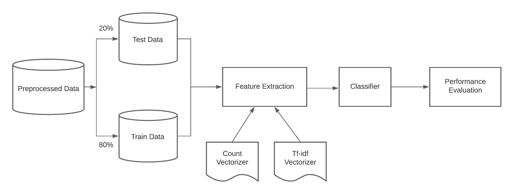
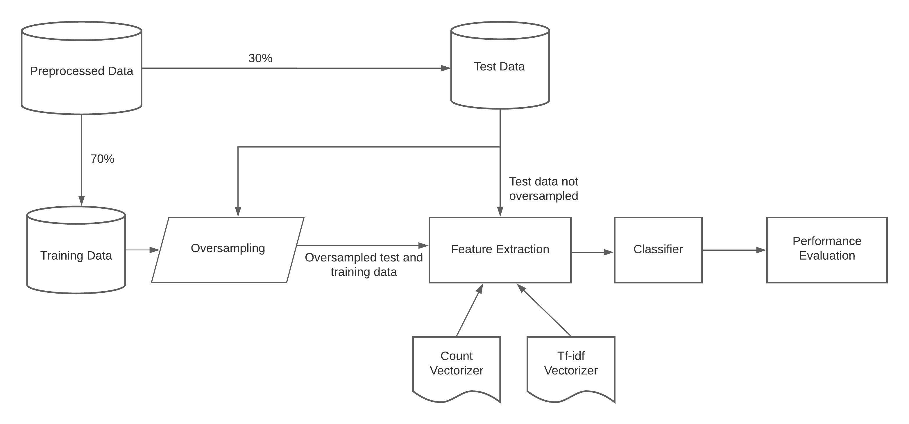

## Approaches for Improving the Performance of Fake News Detection in Bangla
This is the official repository for the research work [Approaches for Improving the Performance of Fake News Detection in Bangla: Imbalance Handling and Model Stacking](https://link.springer.com/chapter/10.1007/978-981-19-2445-3_51).  

## Abstract  
*Imbalanced datasets can lead to biasness in the detection of fake news. In this work, we present several strategies for resolving the imbalance issue of fake news detection in Bangla with a comparative assessment of proposed methodologies. Additionally, we propose a technique for improving performance even when the dataset is imbalanced. We applied our proposed approaches to BanFakeNews[^fn1], a dataset developed for the purpose of detecting fake news in Bangla comprising 50K instances but is significantly skewed, with 97% of the majority instances. We obtained a 93.1% F1-score using data manipulation techniques such as SMOTE and a 79.1% F1-score using without data manipulation approaches such as Stacked Generalization. Without implementing these techniques, the F1-score would have been 67.6% for baseline models. We see this work as an important step towards paving the way of fake news detection in Bangla. By implementing these strategies the obstacles of imbalanced dataset can be removed and improvement in the performance can be achieved.*

[^fn1]: Hossain et al. in Banfakenews: A dataset for detecting fake news in bangla. arXiv preprint arXiv:2004.08789, 2020

## Authors
* Md Muzakker Hossain
* Zahin Awosaf
* Md. Salman Hossan Prottoy 
* Abu Saleh Muhammod Alvy

## Dataset

BanFakeNews Dataset: [GitHub](https://github.com/Rowan1697/FakeNews) | [Kaggle](https://www.kaggle.com/datasets/cryptexcode/banfakenews)  

#### List of files
* Authentic-48K.csv
* Fake-1K.csv
* LabeledAuthentic-7K.csv
* LabeledFake-1K.csv

**File Format**
Authentic-48K.csv and Fake-1K.csv

| Column Title   | Description |
| ------------- |------------- |
| articleID      | ID of the news |
| domain      | News publisher's site name      |
| date | Published Date|
| category | Category of the news|
| headline | Headline of the news|
| content | Article or body of the news|
| label | 1 or 0 . '1' for authentic '0' for fake|

LabeledAuthentic-7K.csv, LabeledFake-1K.csv

|Column Title   |Description |
|------------- |------------- |
| articleID | ID of the news |
| domain | News publisher's site name |
| date | Published Date |
| category | Category of the news |
| source | Source of the news. (One who can verify the claim of the news) |
| relation | Related or Unrelated. Related if headline matches with content's claim otherwise it is labeled as Unrelated |
| headline | Headline of the news |
| content | Article or body of the news |
| label | 1 or 0 . '1' for authentic '0' for fake |
| F-type | Type of fake news (Clickbait, Satire, Fake(Misleading or False Context))

**F-type** is only present in LabeledFake-1K.csv

## Experiment
#### Techniques Used
* Data Preprocessing
  * Data Standardization
  * Stopwords Removal
  * Stemming
* Feature Extraction
  * Count Vectorizer
  * TF-IDF Vectorizer
* Oversampling
  * Random Oversampling
  * SMOTE
  * ADASYN
* Undersampling
  * Random Undersampling
  * NearMiss
* Modifying Class-Weight
* Model Stacking

#### 

## Diagrams
**Baseline Model**


**Oversampling**


**Stacking**


## Bibtex
```
@InProceedings{10.1007/978-981-19-2445-3_51,
author="Hossain, Md. Muzakker and Awosaf, Zahin and Prottoy, Md. Salman Hossan and Alvy, Abu Saleh Muhammod and Morol, Md. Kishor",
title="Approaches for Improving the Performance of Fake News Detection in Bangla: Imbalance Handling and Model Stacking",
booktitle="Proceedings of International Conference on Fourth Industrial Revolution and Beyond 2021 ",
year="2022",
publisher="Springer Nature Singapore",
pages="723--734",
}
```
